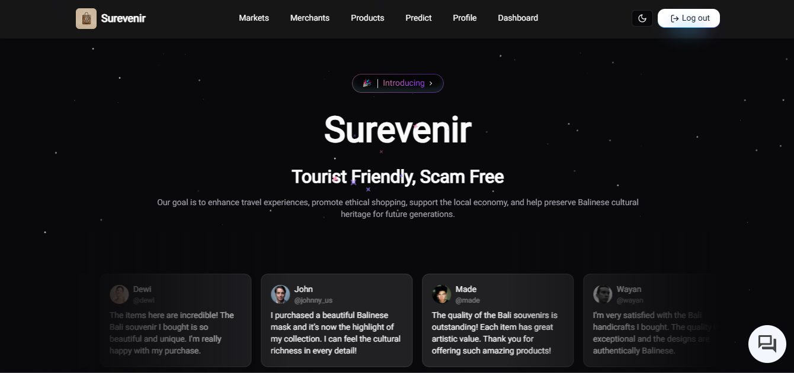

# Surevenir Web App

<div align="center">
  
</div>

This project is a **web-based application** designed as a **dashboard** tailored specifically for **admin** and **merchant roles**. The dashboard facilitates the management of critical data such as:

- **Markets**: Manage market information and details.
- **Merchants**: Oversee merchant data and activities.
- **Products**: Add, update, or remove products listed in the marketplace.
- **Orders**: Track and process customer orders efficiently.
- **Users**: Manage user profiles and access.

Beyond the dashboard, the platform also serves as a **marketplace focused exclusively on souvenirs**, providing features for all users to:

- **Browse Market Listings**: Explore various markets available in the system.
- **Discover Merchants and Products**: View detailed information about merchants and their products.
- **Scan for Souvenir Details**: Utilize the scan feature to gain in-depth insights into a souvenir, including its origin, cultural background, and price range.

This application aims to deliver a seamless and comprehensive experience for managing and exploring the world of souvenirs, blending the functionalities of a marketplace with the capabilities of a robust admin and merchant dashboard.

## Features

- **Next.js Framework**: Fast and SEO-friendly web application with SSR and SSG capabilities.
- **React Integration**: Powerful and reusable component-based architecture.
- **TailwindCSS**: Utility-first CSS framework for rapid UI development.
- **TypeScript Support**: Strongly-typed codebase for better maintainability and reduced runtime errors.
- **Responsive Design**: Ensures optimal user experience across devices.
- Environment-based configuration using `.env.local` for secure and dynamic setups.

## Project Structure

The project is organized into the following structure for better readability and scalability:

```
surevenir-web/
├── public/         # Static files (e.g., images, icons, fonts)
├── src/
│   ├── app/        # Next.js routing system (pages and API routes)
│   ├── components/ # Reusable UI components
│   ├── styles/     # Global and module-specific CSS files
│   ├── utils/      # Utility functions
│   ├── hooks/      # Custom React hooks
│   └── types/      # Custom TypeScript type definitions
├── .gitignore      # Specifies intentionally untracked files that Git should ignore.
├── components.json # Shadcn Component
├── Dockerfile      # Docker configuration files
├── example.env      # Environment variables
├── next.config.js  # Next.js configuration file
├── tailwind.config.js # TailwindCSS configuration file
├── tsconfig.json   # TypeScript configuration file
└── package.json    # Project dependencies and scripts
```

## Prerequisites

Ensure you have the following tools installed:

- **Node.js** (version 16 or later)
- **npm** or **yarn**

## Installation

To set up the project locally, follow these steps:

1. Clone this repository:

   ```bash
   git clone https://github.com/surevenir/surevenir-web.git
   cd surevenir-web/
   ```

2. Install dependencies:

   ```bash
   npm install
   yarn install
   ```

3. Install dependencies:

   ```bash
   npm install
   yarn install
   ```

4. Configure environment variables:

   ```bash
   cp example.env .env
   ```

5. Start the development server:

   ```bash
   npm run dev
   yarn dev
   ```

## Scripts

```bash
npm run dev / yarn dev      # Start the development server.
npm run build / yarn build  # Build the application for production.
npm run start / yarn start  # Start the production server.
npm run lint / yarn lint    # Run linting checks.
```

## Deployment

1. Build the project:

Compile TypeScript files into JavaScript for production use:

```bash
npm run build
```

2. Set up the production environment variables:

Ensure that the .env file is properly configured for production settings.

3. Build image:

```bash
docker build -t <tag> .
```

3. Push image:

```bash
docker push <tag>
```

## Technologies Used

- Framework: Next.js
- Styling: TailwindCSS
- Language: TypeScript
- Component: ShadcnUI & MagicUI
- Icons: Lucide React

## Thank You
